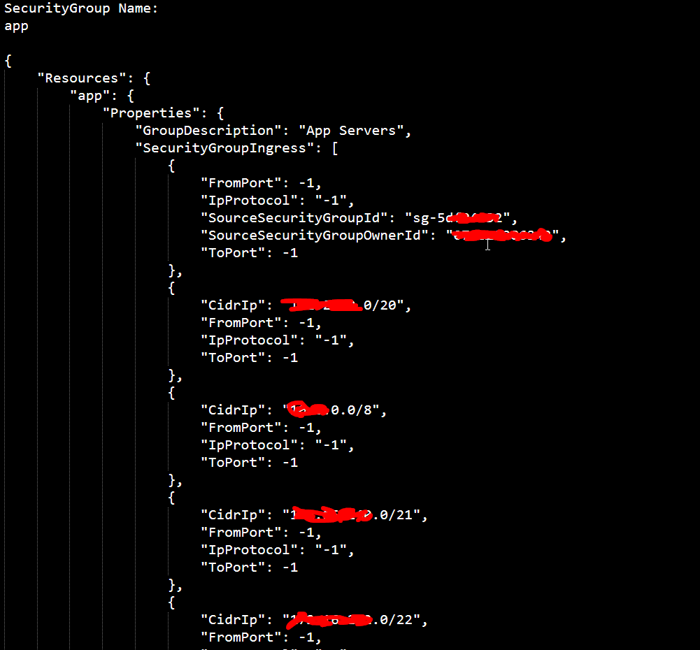
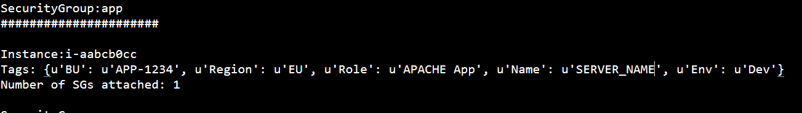

Requirements:  
- Requires Troposphere (https://github.com/cloudtools/troposphere)
- Requires Boto
                

DESCRIPTION: 
In our environment there are a lot of security group changes on a daily basis.  For us to make sure things are the way they are when we declare DR(Region Level), we take regular backup of our security group and dump it to an S3 bucket.  This was pre "AWS Config" days where changes where not being captured.  

This script will create a file that will output a cloud formation template for all the SG in a given region.  Additinally you can send the output file to S3 bucket as backup.

Below is a screenout of the sample cloudformation template you can use in DR region.

Also as part of this script we capture what instance below to what security group.

